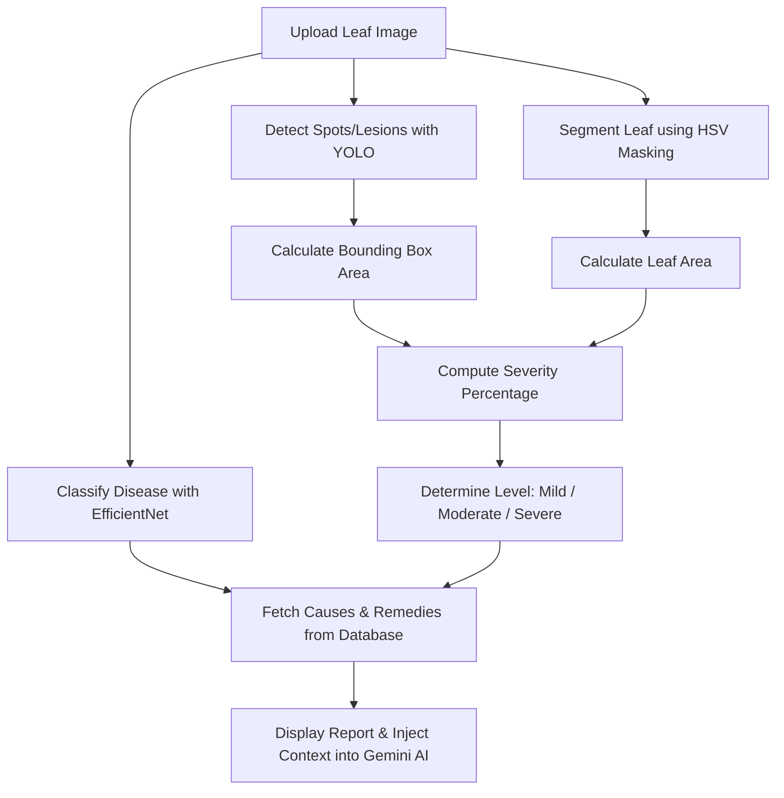

# AgroVision: Plant Disease Detection & Severity Estimation

AgroVision is a modern web-based agricultural diagnostic system that combines Deep Learning computer vision models with Large Language Models (LLMs) to help farmers and agronomists instantly diagnose crop health.

The system uses a **dual-model pipeline** to classify tomato leaf diseases and calculate severity, then provides an interactive **context-aware AI Assistant** to answer treatment questions.

---

## 🌟 Key Features

1. **Leaf Disease Classification**:
   - Utilizes a pre-trained **EfficientNet** classification model to identify tomato leaf conditions.
   - Detects **9 unique leaf diseases** as well as healthy leaves.

2. **Severity Estimation & Quantification**:
   - Uses a **YOLO** object detection model to detect individual infection spots/lesions on the leaf.
   - Applies **HSV Color Masking** (hue-saturation-value) to segment the leaf from the background and calculate total leaf area.
   - Computes the exact ratio of infected area to total leaf area:
     $$\text{Severity (\%)} = \left( \frac{\text{Infected Spot Area}}{\text{Total Leaf Area}} \right) \times 100$$
   - Categorizes severity into levels: **Mild** ($<10\%$), **Moderate** ($10\% - 40\%$), and **Severe** ($\ge 40\%$).

3. **Agro AI Interactive Assistant**:
   - Fully integrated chatbot powered by **Google Gemini** (`gemini-2.5-flash`).
   - Automatically receives context from the image analysis (the diagnosed disease), allowing it to provide relevant, custom treatment advice without manual user input.
   - Renders replies with rich formatting (markdown, bold text, lists).

4. **Premium User Interface**:
   - Modern, responsive web design using a glassmorphic design system.
   - Drag-and-drop file uploader with instant previews.
   - Interactive, minimizable, and expandable chat overlay widget.

---

## 🛠️ Tech Stack & Dependencies

- **Frontend**: HTML5, Vanilla CSS3 (Custom design, Google Fonts - Inter), Javascript (ES6+, Marked.js for markdown rendering).
- **Backend**: Python 3.10, Flask (Web framework), `python-dotenv` for configuration.
- **Machine Learning & CV**:
  - `tensorflow` / `keras` (EfficientNet classification)
  - `ultralytics` (YOLO spot detection)
  - `opencv-python` (Image processing & HSV masking)
  - `numpy` (Numerical operations)
- **Generative AI**: `google-generativeai` (Gemini API integration).

---

## 📁 Project Structure

```text
plant-disease-system_miniProject/
├── backend/
│   ├── model_loader.py       # Load YOLO and TensorFlow models once
│   ├── predictor.py          # Main pipeline: classification + severity calculations
│   ├── utils.py              # Image preprocessing utility for EfficientNet
│   └── disease_info.json     # Local database for disease causes & remedies
├── models/
│   ├── best.pt               # Pre-trained YOLO weights (spot detection)
│   └── v1/
│       └── plant_disease...  # Pre-trained Keras model (EfficientNet classification)
├── static/
│   ├── script.js             # Frontend interactions, AJAX requests & markdown parsing
│   └── style.css             # Glassmorphism theme, responsiveness & chat styles
├── templates/
│   └── index.html            # Core page template with upload interface and chat widget
├── uploads/                  # Temporary storage folder for uploaded leaf images
├── .env                      # API keys and local environment configurations
├── .gitignore                # Files excluded from Git tracking
├── .dockerignore             # Files excluded from Docker context
├── Dockerfile                # Deployment configuration file
├── requirements.txt          # Python packages list
└── README.md                 # Project documentation (This file)
```

---

## 🔍 The Machine Learning Pipeline

When a user uploads a leaf image, the backend runs it through a multi-stage pipeline:



1. **Classification (EfficientNet)**:
   The image is resized to $160 \times 160$ pixels and scaled. The model predicts the probability of the leaf belonging to one of the following classes:
   - Tomato Bacterial Spot
   - Tomato Early Blight
   - Tomato Late Blight
   - Tomato Leaf Mold
   - Tomato Septoria Leaf Spot
   - Tomato Spider Mites (Two-spotted spider mite)
   - Tomato Target Spot
   - Tomato Yellow Leaf Curl Virus
   - Tomato Mosaic Virus
   - Tomato Healthy

2. **Leaf Area Masking**:
   The image is converted to the HSV color space. A color range threshold masking is applied to isolate green, yellow, and brown leaf pixels:
   - Lower HSV bound: `[20, 30, 30]`
   - Upper HSV bound: `[100, 255, 255]`
   The count of non-zero pixels inside this mask yields the total leaf area.

3. **Infection Spot Detection (YOLO)**:
   The YOLO model detects infection spots (lesions). Any bounding boxes with confidence $> 0.15$ are accepted. The sum of the areas of these bounding boxes gives the infected area.

4. **Severity Evaluation**:
   The percentage ratio yields the severity, which determines the classification stage (Mild, Moderate, or Severe).

---

## ⚙️ Installation & Local Setup

### Prerequisites
- Python 3.10 or higher installed.
- A Google Gemini API Key (obtain from [Google AI Studio](https://aistudio.google.com/)).

### Step 1: Clone or Open the Directory
Navigate into the project workspace:
```bash
cd plant-disease-system_miniProject
```

### Step 2: Set Up a Virtual Environment (Recommended)
Create and activate a virtual environment:
```bash
# Windows
python -m venv venv
venv\Scripts\activate

# macOS / Linux
python3 -m venv venv
source venv/bin/activate
```

### Step 3: Install Required Dependencies
Install the required packages listed in `requirements.txt`:
```bash
pip install -r requirements.txt
```

### Step 4: Configure Environment Variables
Create a `.env` file in the root directory (or edit the existing one) and add your Google Gemini API Key:
```env
GEMINI_API_KEY=your_actual_gemini_api_key_here
```

### Step 5: Run the Web Server
Launch the Flask development server:
```bash
python app.py
```
Open your browser and navigate to `http://127.0.0.1:5000`.

---


## 💡 How to Use
1. **Upload**: Drag & drop or click to upload a photo of a tomato leaf.
2. **Analyze**: Click **Analyze Leaf Health**. The app displays the disease diagnosis, infected spot count, severity percentage, severity level, potential causes, and recommended treatments.
3. **Chat**: Use the **Agro AI Assistant** widget in the bottom right corner. Ask follow-up questions like *"What fungicides work best for this?"* or *"How can I prevent this in my greenhouse?"*. The AI will guide you based on your specific leaf's diagnosis context.
